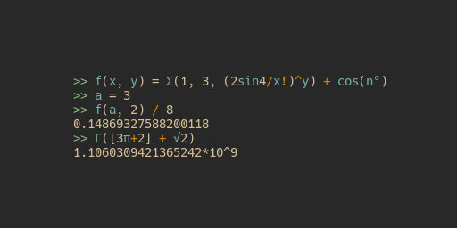

# kalk

Kalk is a calculator (both program and library) that supports user-defined variables, functions, and units (experimental, limited). It runs on Windows, macOS, Linux, and in web browsers (with WebAssembly).  

[Kanban](https://kolan.strct.net/Board/4RAdMjLDz) | [Website](https://kalk.strct.net)

## Features
* Operators: +, -, \*, /, !
* Groups: (), ⌈⌉, ⌋⌊
* [Pre-defined functions and constants](https://github.com/PaddiM8/kalk/blob/master/kalk/src/prelude.rs)
* User-defined functions and variables. `f(x, y) = xy`, `x = 5`
* User-defined units (experimental). `unit m = cm/100`, `2m/50cm`, `50cm to m`
* Understands fairly ambiguous syntax. Eg. `2sin50 + 2xy`
* Syntax highlighting
* Special-symbol completion on tab. Eg. write `sqrt` and press tab. It will be turned into `√`.
* Sum function: `sum(start, to, expression)` Eg. `sum(1, 3, 2n+1)` is the same as `2*1+1 + 2*2+1 + 2*3+1` = `15`
* Load a file including predefined functions and constants. For example, if you're going to use Kalk for physics, you load up your file with physics functions/constants when starting Kalk. `-i file`
* Misc: separate expressions by a semicolon to write them on the same line, use the `ans` variable to get the value of the previously calculated expression.

## Libraries

There are currently three different libraries related to kalk.
* [kalk](https://crates.io/crates/kalk): The Rust crate that powers it all.
* [@paddim8/kalk](https://www.npmjs.com/package/@paddim8/kalk): JavaScript bindings to `kalk`. This lets you use it in the browser, thanks to WebAssembly.
* [@paddim8/kalk-component](https://www.npmjs.com/package/@paddim8/kalk-component): A web component that acts as a frontend to `@paddim8/kalk`, which lets you use kalk in the browser with a command line-like interface.

## Installation
### Binaries
Pre-compiled binaries for Linux, Windows, and macOS (64-bit) are available in the [releases page](https://github.com/PaddiM8/kalk/releases).
### Compiling
**Minimum rust version: v1.36.0**. Make sure you have `diffutils` `gcc` `make` and `m4` installed. **If you use windows:** [follow the instructions here](https://docs.rs/gmp-mpfr-sys/1.2.3/gmp_mpfr_sys/index.html#building-on-windows) (don't forget to install `mingw-w64-x86_64-rust` in MSYS2).

#### Cargo
Run `cargo install kalk_cli`

#### Manually
1. Go into the `kalk_cli` directory.
2. Run `cargo build --release`
3. Grab the binary from `targets/release`

## Syntax
A more complete reference can be found on [the website](https://kalk.strct.net)

### Functions
__Defining:__ name(parameter1, parameter2, ...) = expression  
**Example:** `f(x) = 2x+3`  

__Using:__ name(argument1, argument2)  
**Example:** `f(2)`  

### Variables
__Defining:__ name = expression  
**Example:** `x = 3`  

__Using:__ name  
**Example:** `x`  

### Units (experimental, are likely to not work properly)
*Note: You only need to define the relationship between two units once. You will be able to convert between both of them.*
__Defining:__ `unit` name = expression  
**Example:** `unit deg = (rad*180)/π`  

__Using:__ Use them freely in expressions.  
**Example:** `2m/50cm`  

__Converting:__ expression `to` unit  
**Example:** `2 m to cm`  
