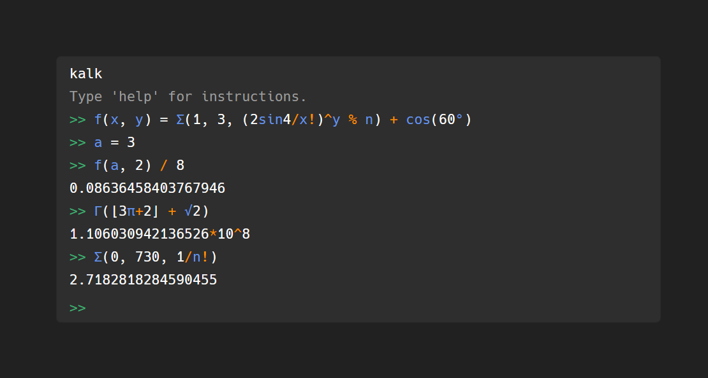

# Kalker Web Component


A web component built with Svelte that uses the kalk library (WebAssembly).



## Installation & Setup
 `npm install --save @paddim8/kalk-component`

### Module
```js
import { KalkCalculator, ConsoleLine } from "@paddim8/kalk-component"
```
If your bundler doesn't include all the files in the output folder,
you may need to eg. modify your build script to copy them over manually.
I am not aware of a better way.

### Or only with HTML
```html
<script type="text/javascript" src="some/path/bundle.js"></script>
```

## Usage
```html
<div class="kalk"> <!-- Apply css rules for position/size/font/etc. to this -->
    <kalk-calculator>
        <console-line>kalker</console-line>
        <console-line>
            <span class="hint">Type 'help' for instructions.</span>
        </console-line>
</kalk-calculator>
</div>
```

## Customizing
The colours in the component can be changed by using these attributes.
```html
<kalk-calculator
    hinttext="Type something..." 
    autofocus="true"
    identifiercolor="cornflowerblue"
    operatorcolor="darkorange"
    promptcolor="mediumseagreen"
    errorcolor="tomato"
    hintcolor="#9c9c9c"
    linkcolor="cornflowerblue"
    backgroundcolor="#424242" />
```